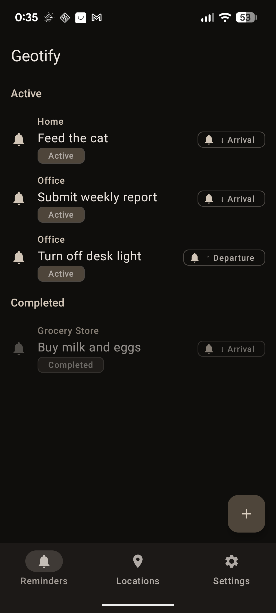
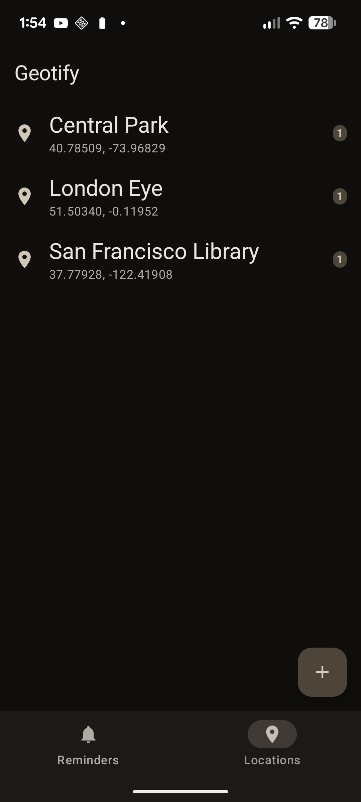

# Geotify

Geotify is a modern, location-aware Android application that allows users to create and manage geofenced reminders. Designed with modern Android development practices, it features a beautiful Jetpack Compose interface, interactive mapping, and exposes advanced system-level **Jetpack AppFunctions**, making it capable of being driven by on-device LLMs or voice assistants.

---

## Features

- **Location Management**: Save current GPS coordinates or pick custom coordinates interactively using an embedded **Map Picker**, with support for custom location aliases (e.g., *'home'*, *'gym'*, *'mom's house'*), custom geofence radii (minimum 50 meters, defaults to 150 meters), and custom notification responsiveness settings (0 to 10 minutes, defaults to 2 minutes) to balance battery consumption and latency.
- **Geofenced Reminders**: Create triggers that display notifications when arriving or departing from any saved location.
- **Interactive Map View**: Displays all saved locations and active geofences dynamically using **OpenStreetMap (osmdroid)**. The map automatically centers and fits all points, handles selection synchronization, and supports themed map tiles (light and dark mode).
- **Theme & Map Customization**: Configure independent theme choices for the application UI and the map rendering (System Default, Light, or Dark Mode).
- **Jetpack AppFunctions**: Exposes system-discoverable APIs, enabling assistant-driven or LLM-driven actions directly inside the app.
- **In-App Guidance Banners**: Automatically alerts the user with a banner if background location permissions are missing, offering a direct action to grant them.
- **Persistent Local Storage**: Utilizes **Room Database** for locations/reminders and **Jetpack DataStore (Preferences)** for theme settings.
- **Reliable Background Execution**: Integrates Google Play Services Geofencing API and registers a `BroadcastReceiver` to handle location transitions even when the app is closed.
- **Geofence Limit Enforcement**: Hard limit of 100 active geofences on the device, displaying errors and warnings to comply with OS constraints.
- **Boot Recovery**: Automatically re-registers active geofences on device boot.
- **Material 3 Design**: Features a fully responsive user interface utilizing Jetpack Compose and Material Design 3 guidelines.
- **Internationalization (i18n)**: Out-of-the-box localization for English, Spanish, German, French, Italian, and Portuguese.

---

## Screenshots

| Reminders (Default Screen) | Locations |
|:---:|:---:|
|  |  |

---

## Expose AppFunctions (AI / Agentic Integration)

Geotify implements **Jetpack AppFunctions** (via the `androidx.appfunctions` APIs). This acts as a bridge that allows system services, voice assistants, and local Large Language Models (LLMs) to discover and execute actions within the app context.

> [!NOTE]
> When integrating or calling these functions programmatically via the Jetpack AppFunctions framework, the first parameter (`appFunctionContext: AppFunctionContext`) is automatically injected by the system and is omitted from the assistant/caller-facing schemas.

### AppFunction APIs

- **`saveCurrentLocation(alias: String)`**
  * **Description**: Automatically fetches the current high-accuracy GPS coordinates in the background and saves them under the given alias.
  * **Returns**: `SaveLocationResult`
- **`createGeofenceReminder(targetAlias: String, payloadMessage: String, triggerOnArrival: Boolean)`**
  * **Description**: Creates a reminder linked to a saved location alias, specifying whether it should fire on entry (arrival) or exit (departure).
  * **Returns**: `CreateReminderResult`
- **`listLocations()`**
  * **Description**: Retrieves all saved locations, showing their names and coordinates.
  * **Returns**: `List<SavedLocation>`
- **`deleteLocation(alias: String)`**
  * **Description**: Deletes a saved location along with all associated reminders and active geofences.
  * **Returns**: `DeleteResult`
- **`deleteReminder(targetAlias: String, message: String?)`**
  * **Description**: Cancels and removes active geofence triggers matching the location. The message is optional; if omitted and only one active reminder exists for that location, it is deleted. If multiple reminders exist, it throws an error listing active reminders to resolve ambiguity.
  * **Returns**: `DeleteResult`
- **`listActiveReminders()`**
  * **Description**: Retrieves all currently active reminders, detailing their IDs, location aliases, messages, and triggers.
  * **Returns**: `List<SavedReminder>`

### Data Schemas / Return Types

#### `SaveLocationResult`
```kotlin
data class SaveLocationResult(
    val alias: String,      // The alias assigned to the saved location
    val status: String     // Human-readable status (e.g. "Location successfully saved.")
)
```

#### `CreateReminderResult`
```kotlin
data class CreateReminderResult(
    val reminderId: String,     // Unique identifier of the newly created reminder
    val targetAlias: String,    // The alias of the target location
    val payloadMessage: String, // The reminder message displayed when triggered
    val triggerType: String,    // "arrival" or "departure"
    val warning: String?        // Warning if geofence limit is reached (optional)
)
```

#### `SavedLocation`
```kotlin
data class SavedLocation(
    val alias: String,      // Human-readable alias name
    val latitude: Double,   // Latitude coordinate
    val longitude: Double   // Longitude coordinate
)
```

#### `DeleteResult`
```kotlin
data class DeleteResult(
    val alias: String,     // The alias of the deleted location or reminder target
    val deleted: Boolean   // Whether the deletion was successful (true/false)
)
```

#### `SavedReminder`
```kotlin
data class SavedReminder(
    val reminderId: String,     // Unique identifier of the reminder
    val targetAlias: String,    // Alias of the target location
    val payloadMessage: String, // Reminder message
    val triggerType: String     // "arrival" or "departure"
)
```

---

## Tech Stack & Architecture

Geotify is built on a clean MVVM (Model-View-ViewModel) architecture:

- **Language**: [Kotlin](https://kotlinlang.org/)
- **UI Framework**: [Jetpack Compose](https://developer.android.com/compose) (with Material Design 3)
- **Local DB**: [Room Database](https://developer.android.com/training/data-storage/room)
- **Preferences**: [Jetpack DataStore](https://developer.android.com/topic/libraries/architecture/datastore) (Preferences DataStore)
- **Maps Integration**: [OpenStreetMap (osmdroid)](https://github.com/osmdroid/osmdroid) for map picker and list visualization
- **Location & Geofencing**: Google Play Services Location APIs (`FusedLocationProviderClient`, `GeofencingClient`)
- **Dependency Injection**: [Dagger Hilt](https://developer.android.com/training/dependency-injection/hilt-android)
- **Integration**: Jetpack AppFunctions (`androidx.appfunctions`) with KSP code-generation
- **Asynchronous Flow**: Kotlin Coroutines & Flows
- **Dependency Resolution**: Gradle Version Catalogs (`libs.versions.toml`)

---

## System Permissions Required

To function correctly in the background, Geotify requests the following permissions:

- `ACCESS_FINE_LOCATION` & `ACCESS_COARSE_LOCATION`: To obtain the device's coordinates for saving/picking locations.
- `ACCESS_BACKGROUND_LOCATION`: Required by the system to monitor geofences in the background when the app is minimized or closed.
- `POST_NOTIFICATIONS`: To show reminders when geofence transitions occur.
- `RECEIVE_BOOT_COMPLETED`: To automatically restore geofences when the device restarts.

---

## Building the Project

Ensure you have Android Studio installed.

1. Clone this repository:
   ```bash
   git clone git@github.com:arrase/Geotify.git
   cd Geotify
   ```
2. Build the project using Gradle:
   ```bash
   ./gradlew assembleDebug
   ```
3. Run the application on an emulator or a physical Android device with Google Play Services enabled.
