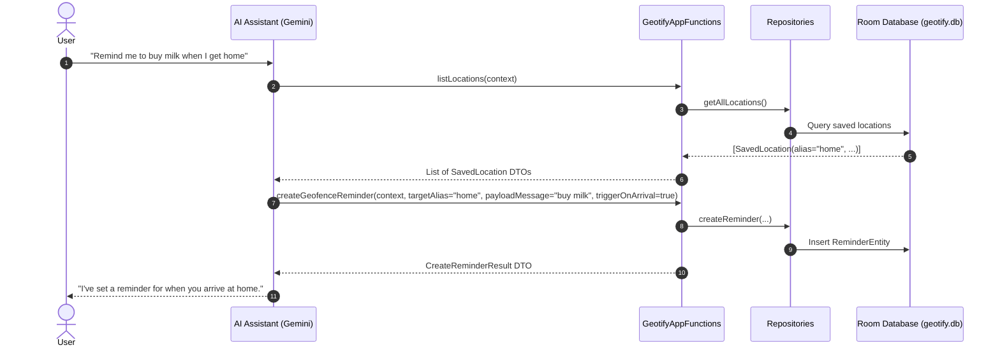

# AppFunctions (AI Assistant Integration)

Android 16 introduces `androidx.appfunctions`, enabling system-level AI assistants (such as Google Gemini) to discover and execute actions within applications without opening the user interface. Geotify exposes six specialized AppFunctions for managing saved locations and geofenced reminders.

---

## Overview & System Flow

When a user prompts an AI assistant (e.g., *"Remind me to buy milk when I arrive at the supermarket"*), the assistant inspects registered `androidx.appfunctions` schemas, builds the parameter payloads, and invokes the function directly in the background.



### Context Injection & Metadata Extraction

Every function in `GeotifyAppFunctions` accepts an `AppFunctionContext` as its first parameter. The system automatically injects this context upon invocation.

- **`@AppFunction(isDescribedByKDoc = true)`**: Instructs the KSP compiler plugin (`androidx.appfunctions.compiler`) to parse KDoc comments into app metadata XML (`app_metadata.xml`), exposing function capabilities to system AI callers.
- **`@AppFunctionSerializable`**: Annotates all return DTO classes (`SaveLocationResult`, `CreateReminderResult`, `SavedLocation`, `DeleteResult`, `SavedReminder`) to allow automated cross-process serialization.

---

## API Summary & Method Specs

`GeotifyAppFunctions` is defined in [`GeotifyAppFunctions.kt`](file:///home/arrase/Develop/Geotify/app/src/main/java/dev/arrase/geotify/appfunction/GeotifyAppFunctions.kt).

| Function | Purpose | Key Parameters | Return Type |
| :--- | :--- | :--- | :--- |
| `saveCurrentLocation` | Captures current device GPS coordinates and saves them under an alias. | `alias: String` | `SaveLocationResult` |
| `createGeofenceReminder` | Attaches a geofence trigger (arrival or departure) to a saved location. | `targetAlias: String`, `payloadMessage: String`, `triggerOnArrival: Boolean` | `CreateReminderResult` |
| `listLocations` | Retrieves all saved points of interest with coordinates. | None | `List<SavedLocation>` |
| `deleteLocation` | Removes a location and all cascaded reminders. | `alias: String` | `DeleteResult` |
| `deleteReminder` | Cancels an active reminder for a location. | `targetAlias: String`, `message: String? = null` | `DeleteResult` |
| `listActiveReminders` | Returns all active reminders across all locations. | None | `List<SavedReminder>` |

---

## Function Details

### `saveCurrentLocation`
Fetches the device's current location via high-accuracy GPS and stores it under a human-readable alias (e.g., `"home"`, `"office"`).
- **Exceptions**: Throws `AppFunctionInvalidArgumentException` if `alias` already exists.

### `createGeofenceReminder`
Registers a geofence notification for a saved location alias.
- **`triggerOnArrival`**: `true` for entry transition (`GEOFENCE_TRANSITION_ENTER`), `false` for exit transition (`GEOFENCE_TRANSITION_EXIT`).
- **Exceptions**: Throws `AppFunctionInvalidArgumentException` if `targetAlias` is not found.

### `listLocations`
Returns a list of all saved POIs (`SavedLocation(alias, latitude, longitude)`).

### `deleteLocation`
Deletes a saved location by alias. Removes associated reminders automatically via SQLite foreign key cascading rules.

### `deleteReminder`
Deletes active reminders matching `targetAlias`.
- If `message` is specified, performs a case-insensitive substring match. If `message` is omitted and multiple reminders exist for that location, throws an exception requiring clarification.

### `listActiveReminders`
Returns all active reminders (`SavedReminder(reminderId, targetAlias, payloadMessage, triggerType)`).

---

## AI Self-Correction Strategy (`throwAliasNotFound`)

When an invalid location alias is passed by an AI caller, Geotify returns actionable feedback rather than a generic error. The application queries all existing aliases and embeds them directly into the exception message:

```kotlin
private suspend fun throwAliasNotFound(alias: String): Nothing {
    val aliases = locationRepository.getAllAliases()
    val message = if (aliases.isEmpty()) {
        "Alias '$alias' not found. No locations are saved yet. Please save a location first using saveCurrentLocation."
    } else {
        "Alias '$alias' not found. Valid locations are: ${aliases.joinToString()}. Map the user's intent to an exact value from this list and invoke again."
    }
    throw AppFunctionInvalidArgumentException(message)
}
```

### Self-Correction Lifecycle Example

1. **User request**: *"Remind me to buy bread at the store."*
2. **AI Action**: Invoques `createGeofenceReminder(targetAlias="store", ...)`
3. **App Exception**:
   > `AppFunctionInvalidArgumentException`: *"Alias 'store' not found. Valid locations are: home, supermarket, gym. Map the user's intent to an exact value from this list and invoke again."*
4. **AI Recovery**: The AI assistant reads the available alias list, maps `"store"` to `"supermarket"`, and re-invokes `createGeofenceReminder(targetAlias="supermarket", ...)`.
