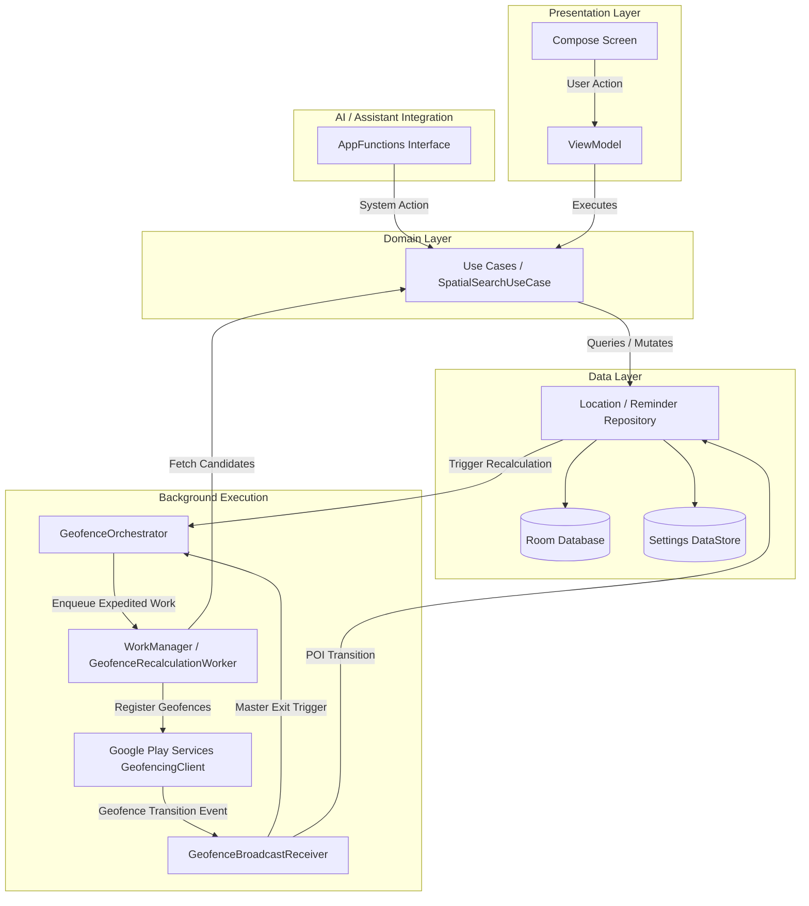

# Architecture & System Design

Geotify is built following **Android Clean Architecture** guidelines and the **MVVM (Model-View-ViewModel)** design pattern. This architecture ensures strict separation of concerns, high testability, and unidirectional data flow (UDF).

---

## Tech Stack Overview

| Layer / Subsystem | Technology | Purpose & Usage |
| :--- | :--- | :--- |
| **Language** | [Kotlin](https://kotlinlang.org/) | Idiomatic Kotlin codebase utilizing Coroutines and Flows for async operations. |
| **UI Framework** | [Jetpack Compose](https://developer.android.com/compose) | Declarative UI with Material Design 3 components and dynamic themes. |
| **Dependency Injection** | [Dagger Hilt](https://developer.android.com/training/dependency-injection/hilt-android) | Compile-time dependency injection container. |
| **Database & Persistence** | [Room](https://developer.android.com/training/data-storage/room) & [DataStore](https://developer.android.com/topic/libraries/architecture/datastore) | SQLite ORM (`geotify.db`) for entities; Preferences DataStore for settings. |
| **Map Rendering** | [osmdroid](https://github.com/osmdroid/osmdroid) | OpenStreetMap tile rendering, custom marker graphics, and geofence overlays. |
| **Location & Geofencing** | [Google Play Services](https://developers.google.com/android/reference/com/google/android/gms/location/package-summary) | `FusedLocationProviderClient` for GPS and `GeofencingClient` for background triggers. |
| **Background Scheduling** | [Jetpack WorkManager](https://developer.android.com/topic/libraries/architecture/workmanager) | Expedited job scheduling for sliding window spatial recalculations. |
| **AI Assistant API** | [Jetpack AppFunctions](https://developer.android.com/jetpack/androidx/releases/appfunctions) | Structured background API surface for on-device LLMs (`androidx.appfunctions`). |

---

## Architecture Layers

```
                      +----------------------------------+
                      |         Presentation Layer       |
                      |  Jetpack Compose + ViewModels    |
                      +----------------+-----------------+
                                       |
                                       v
                      +----------------------------------+
                      |           Domain Layer           |
                      |   Use Cases & Business Logic     |
                      +----------------+-----------------+
                                       |
                                       v
                      +----------------------------------+
                      |            Data Layer            |
                      |  Repositories, Room DB, DataStore |
                      +----------------+-----------------+
                                       |
                                       v
                      +----------------------------------+
                      |          System / GMS            |
                      |  GMS Geofencing, WorkManager     |
                      +----------------------------------+
```

### Presentation Layer
- **Components**: Compose screens (`RemindersScreen`, `LocationsScreen`, `SettingsScreen`) and reusable components (`LocationMapView`, `MapPicker`).
- **ViewModels**: `RemindersViewModel`, `LocationsViewModel`, `SettingsViewModel`. Expose UI states via `StateFlow` and handle user interactions.

### Domain Layer
- Encapsulates business logic into standalone **Use Cases**:
  - `SpatialSearchUseCase`: Bounding box filtering and distance sorting for active geofences.
  - `SaveCurrentLocationUseCase`: High-accuracy location capture and persistence.
  - `CreateReminderUseCase`: Validating and creating geofenced triggers.
  - `DeleteLocationUseCase` & `DeleteReminderUseCase`: Entity cleanup and active fence updates.

### Data Layer
- **Repositories**: `LocationRepository` and `ReminderRepository` act as single sources of truth.
- **Data Access Objects (DAOs)**: `LocationDao` and `ReminderDao` perform Room SQLite queries.
- **DataStore**: `SettingsManager` manages preferences such as outer radius `N`, inner radius `r`, recalculation debounce delays, and theme modes.

---

## Component Interaction Flow



---

## OpenStreetMap (osmdroid) Integration

Geotify embeds osmdroid's Android `MapView` inside Jetpack Compose via `AndroidView`.

### Custom Dark Theme Tile Color Filtering

To render dark-mode map tiles without custom tile servers, Geotify applies a programmatic `ColorMatrixColorFilter` to the map tile layer:

```kotlin
if (isDarkTheme) {
    val filter = ColorMatrixColorFilter(ColorMatrix(floatArrayOf(
        -0.1491f, -0.5005f, -0.0504f, 0f, 215f,
        -0.1491f, -0.5005f, -0.0504f, 0f, 215f,
        -0.1491f, -0.5005f, -0.0504f, 0f, 230f,
        0f,        0f,        0f,        1f, 0f
    )))
    map.overlayManager.tilesOverlay.setColorFilter(filter)
} else {
    map.overlayManager.tilesOverlay.setColorFilter(null)
}
```

### Compose Map Lifecycle Handling

Calling `MapView.onDetach()` during transient composable recompositions or visibility toggles (e.g., `AnimatedVisibility`) permanently destroys osmdroid's background tile writer thread.

Geotify binds `MapView.onDetach()` strictly to `ON_DESTROY` of the host `ActivityLifecycleOwner`, calling only `MapView.onPause()` during composition disposal:

```kotlin
DisposableEffect(mapViewRef, lifecycle) {
    val map = mapViewRef ?: return@DisposableEffect onDispose {}
    val observer = LifecycleEventObserver { _, event ->
        when (event) {
            Lifecycle.Event.ON_RESUME -> map.onResume()
            Lifecycle.Event.ON_PAUSE -> map.onPause()
            Lifecycle.Event.ON_DESTROY -> map.onDetach()
            else -> {}
        }
    }
    lifecycle.addObserver(observer)
    onDispose {
        lifecycle.removeObserver(observer)
        map.onPause() // Do NOT call map.onDetach() here!
    }
}
```
