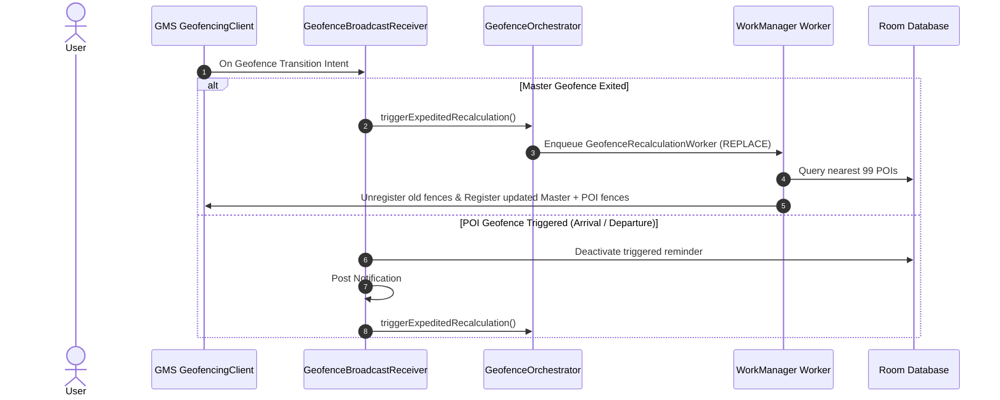

# Geofencing Engine & Sliding Window Algorithm

Google Play Services limits Android applications to registering a maximum of **100 active geofences** per app. To support unlimited saved locations and geofenced reminders, Geotify implements a **Sliding Window Geofencing Algorithm**.

---

## Dual-Ring Spatial Model

The sliding window partitions active locations into two distinct circular boundaries:

```text
                  +---------------------------------------+
                  |  Outer Search Radius N (e.g. 5.0 km)  |
                  |                                       |
                  |     +---------------------------+     |
                  |     | Inner Master Radius r     |     |
                  |     | (e.g. 3.0 km)             |     |
                  |     |                           |     |
                  |     |          (User)           |     |
                  |     |                           |     |
                  |     |     POI 1       POI 2     |     |
                  |     +---------------------------+     |
                  |                                       |
                  |               POI 3                   |
                  +---------------------------------------+
                              
        POI 4 (Stored in Room DB - Outside Bounding Radius N)
```

1. **Master Geofence (`r`, default 3 km)**: Centered at the user's location during the last calculation. Monitors `GEOFENCE_TRANSITION_EXIT`. Crossing this boundary triggers an expedited recalculation to re-center the sliding window.
2. **POI Geofences (`N`, default 5 km, max 99 active)**: Up to 99 active locations with active reminders closest to the user within radius `N`.
3. **Capacity Budget**: `99 POIs + 1 Master Geofence = 100 Geofences Maximum`.

---

## Spatial Math & Bounding Box Optimization

To avoid calculating exact Haversine distances across thousands of database entries, Geotify executes a two-stage spatial search implemented in `SpatialSearchUseCase`:

### SQL Bounding Box Pre-Filter

The search area is first approximated using a latitude and longitude bounding box `[minLat, maxLat] × [minLon, maxLon]`:

$$\Delta \text{lat} = \frac{\text{radiusInMeters}}{111,320}$$

$$\Delta \text{lon} = \frac{\text{radiusInMeters}}{111,320 \times \cos(\text{lat}_{\text{rad}})}$$

Where:
- **111,320 meters**: Approximate distance of 1° latitude at the equator.
- **`lat_rad`**: Latitude in radians (`Math.toRadians(centerLat)`).

```kotlin
// SpatialSearchUseCase.kt
val radiusInMeters = radiusN * 1000.0
val latDegreesChange = radiusInMeters / 111320.0

val latRad = Math.toRadians(centerLat)
val cosLat = cos(latRad)
val lonDegreesChange = if (cosLat > 0.0) {
    radiusInMeters / (111320.0 * cosLat)
} else {
    360.0
}
```

### Exact Geodesic Sorting

Locations returned by the bounding-box query are evaluated using `Location.distanceBetween(centerLat, centerLon, pointLat, pointLon, results)`. Points within radius `N` are sorted ascending by distance and limited to `take(MAX_POI_GEOFENCES)` (99 points).

---

## WorkManager & Broadcast Execution

Recalculations are coordinated by `GeofenceOrchestrator` and executed off the main thread by `GeofenceRecalculationWorker`.



### BroadcastReceiver Timeout Safeguard (`goAsyncCoroutine`)

Android limits `BroadcastReceiver.onReceive()` execution time. `GeofenceBroadcastReceiver` uses `goAsyncCoroutine` with a 9-second timeout to safely process database writes and notification posting before returning:

```kotlin
fun BroadcastReceiver.goAsyncCoroutine(
    timeoutMs: Long = 9000L,
    block: suspend CoroutineScope.() -> Unit
) {
    val pendingResult = goAsync()
    CoroutineScope(Dispatchers.Default).launch {
        try {
            withTimeout(timeoutMs) { block() }
        } finally {
            pendingResult.finish()
        }
    }
}
```

### Boot Recovery (`BootCompletedReceiver`)

When the device restarts, GMS clears active geofences. `BootCompletedReceiver` listens for `ACTION_BOOT_COMPLETED` and calls `geofenceOrchestrator.triggerRecalculation()`, restoring all active geofences automatically.
