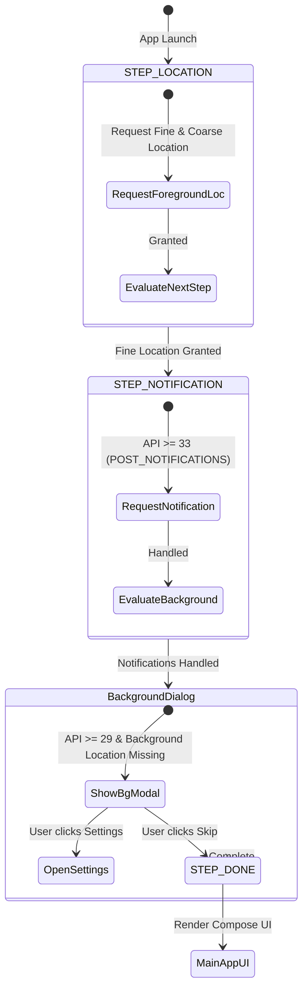

# System Permissions & Progressive Onboarding

Geotify follows Android's privacy guidelines by using a progressive permission onboarding model implemented in [`PermissionGate.kt`](file:///home/arrase/Develop/Geotify/app/src/main/java/dev/arrase/geotify/permission/PermissionFlow.kt).

---

## Permission Matrix

Declared in [`AndroidManifest.xml`](file:///home/arrase/Develop/Geotify/app/src/main/AndroidManifest.xml):

| Permission Name | Minimum API | Purpose in Geotify | Impact if Denied |
| :--- | :--- | :--- | :--- |
| `ACCESS_FINE_LOCATION` | All | High-accuracy GPS positioning for saving points of interest and fence triggers. | High-accuracy geofencing unavailable. |
| `ACCESS_COARSE_LOCATION` | All | Approximate positioning via Wi-Fi and cellular towers. | Reduced boundary detection accuracy. |
| `ACCESS_BACKGROUND_LOCATION` | Android 10+ (API 29+) | Enables `GeofencingClient` to monitor fences when app is closed or backgrounded. | Geofences only trigger when app is open in foreground. |
| `POST_NOTIFICATIONS` | Android 13+ (API 33+) | Posts alert notifications when geofences trigger. | Triggers execute, but no alert banner/sound will display. |
| `RECEIVE_BOOT_COMPLETED` | All | Re-registers active geofences automatically upon device boot. | Geofences remain unmonitored until app is launched. |
| `INTERNET` & `ACCESS_NETWORK_STATE` | All | OpenStreetMap tile rendering in map views. | Map tiles fall back to offline cache. |

---

## Progressive Onboarding Pipeline (`PermissionGate.kt`)

Android guidelines require location permissions to be requested step-by-step rather than all at once:

### Onboarding Steps

1. **Foreground Location**: Prompts for `ACCESS_FINE_LOCATION` and `ACCESS_COARSE_LOCATION` simultaneously.
2. **Notifications**: On Android 13+ (API 33+), requests `POST_NOTIFICATIONS`.
3. **Background Location Explanation**: On Android 10+ (API 29+), displays an explanatory dialog detailing why background location is required for geofences before launching system location settings.

---

## Dynamic Lifecycle Observation

`rememberBackgroundLocationGranted()` registers a `LifecycleEventObserver` listening to `ON_RESUME`. If a user grants or revokes location permissions in Android system settings while backgrounded, the Compose UI state updates immediately upon returning to the app.
