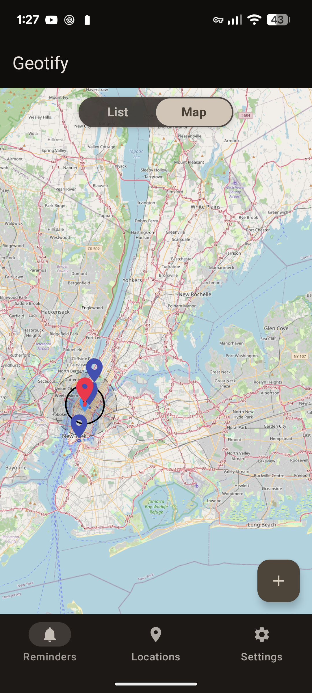
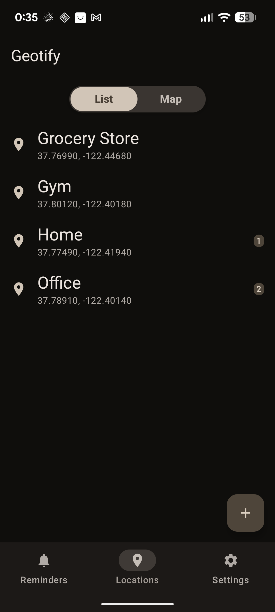
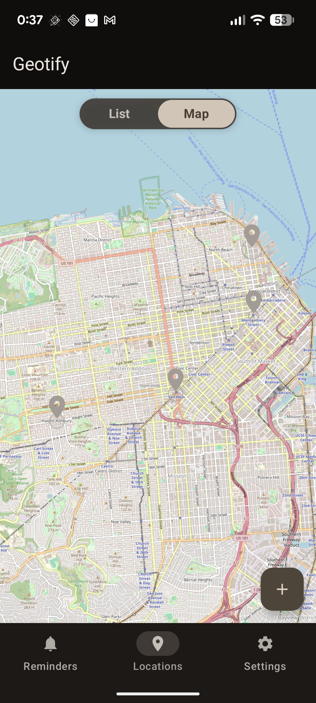
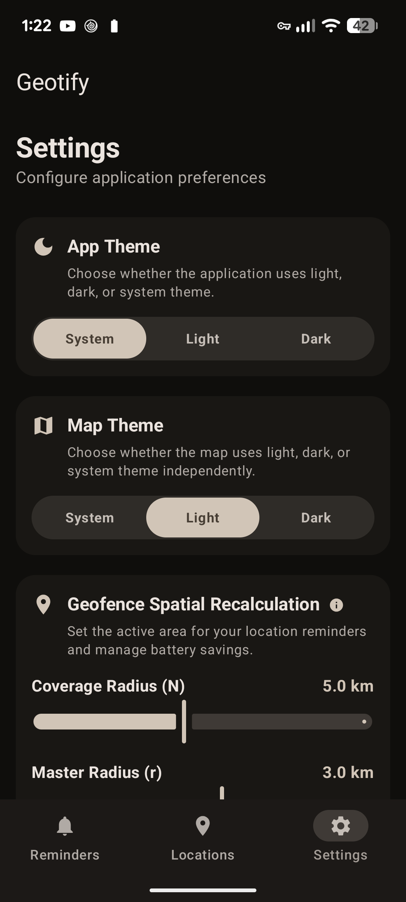

# User Interface & Screen Guide

Geotify features a Jetpack Compose Material Design 3 interface with dynamic navigation, interactive map controls, and an independent dual-theme system.

---

## Core Screens

App navigation consists of three primary screens managed by `GeotifyNavHost`:

### Reminders Screen
File: [`RemindersScreen.kt`](file:///home/arrase/Develop/Geotify/app/src/main/java/dev/arrase/geotify/ui/screen/RemindersScreen.kt)

Central hub for managing geofenced alerts.
- **Reminders List**: Shows active and inactive reminders grouped by status, displaying arrival/departure badges, target location aliases, and range status (`is_in_range`).
- **Interactive Map View**: Displays active geofences on OpenStreetMap with color-coded radius overlays.

| List View | Map View |
| :---: | :---: |
|  *Active reminders list.* |  *Geofence radius overlays on map.* |

---

### Locations Screen
File: [`LocationsScreen.kt`](file:///home/arrase/Develop/Geotify/app/src/main/java/dev/arrase/geotify/ui/screen/LocationsScreen.kt)

Manages saved Points of Interest (POIs).
- **Saved Locations List**: Shows configured POIs, GPS coordinates, geofence radii, and linked active reminder counts.
- **Location Picker Dialog**: Interactive map dialog allowing coordinate selection by tapping or capturing current GPS location.
- **Alias Validation**: Enforces unique location names (case-insensitive) for AI AppFunctions integration.

| Saved Locations List | Map Picker View |
| :---: | :---: |
|  *Saved location points.* |  *Interactive location picker pin.* |

---

### Settings Screen
File: [`SettingsScreen.kt`](file:///home/arrase/Develop/Geotify/app/src/main/java/dev/arrase/geotify/ui/screen/SettingsScreen.kt)

Exposes parameters for fine-tuning geofencing behavior and visual themes.
- **Theme Controls**: Independent application UI theme and map tile layer theme selectors (`SYSTEM`, `LIGHT`, `DARK`).
- **Geofence Radii**: Configurable Outer Radius `N` (km) and Inner Radius `r` (km) for the sliding window algorithm.
- **Responsiveness**: Adjustable location cache timeouts and recalculation debounce delays.

| Settings Screen |
| :---: |
|  *Preferences for themes and geofencing parameters.* |

---

## Independent Dual-Theme System

Geotify manages two independent theme flows via `SettingsManager` in DataStore:

1. **App UI Theme**: Controls Material Design 3 color schemes for buttons, cards, and navigation bars (`SYSTEM`, `LIGHT`, `DARK`).
2. **Map Layer Theme**: Controls OpenStreetMap tile rendering independently. This allows dark-mode app themes to maintain high-contrast light map tiles when outdoor sunlight readability is required.
